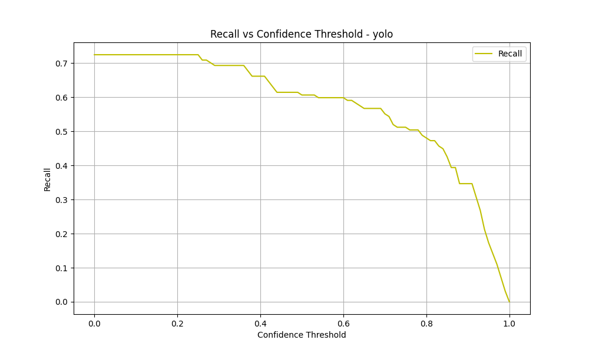

# YOLO-LLM: Enhancing E-Waste Detection through Hybrid Object Detection

This research project explores the integration of YOLO (You Only Look Once) with Google's Gemini LLM to improve electronic waste (e-waste) detection and classification. By combining computer vision with large language models, we aim to create a more robust and accurate system for e-waste management.

## Research Objectives

Our primary goals are to:
- Evaluate YOLO's performance in detecting and classifying electronic devices
- Assess the impact of Gemini LLM validation on detection accuracy
- Compare the effectiveness of standalone YOLO versus the YOLO+Gemini hybrid approach
- Analyze the trade-offs between detection speed and accuracy
- Study model performance across different electronic device categories

## Methodology

### Hybrid Detection Approach
1. **Initial Detection**: YOLO performs the primary object detection and classification
2. **LLM Validation**: Gemini LLM validates and refines YOLO's classifications
3. **Combined Output**: The system merges both models' predictions for final classification

### Dataset and Evaluation
- **Dataset**: 38 distinct classes of electronic devices commonly found in e-waste
- **Evaluation Metrics**:
  - Precision-Recall curves
  - F1 scores
  - Confusion matrices
  - mAP50 and mAP50-95 scores
  - Processing time analysis
  - False positive/negative rates

## Results

### Performance Metrics

#### Precision-Recall Analysis


*Precision-Recall curves demonstrating the trade-off between precision and recall for both approaches*

#### F1 Score Analysis


*F1 score curves showing the harmonic mean of precision and recall across training epochs*

#### Detailed Performance Metrics





*Individual precision and recall curves showing metric evolution during training*

#### Classification Analysis


*Confusion matrices showing the distribution of true and predicted classes for both models*

### Key Findings

1. **Model Performance Comparison**:
   - YOLO+Gemini achieves higher precision (65.5% vs 63.4%) by leveraging Gemini's language understanding
   - Improved recall (74.8% vs 72.4%) in challenging detection scenarios
   - Better mAP50 (75.6% vs 73.2%) demonstrating superior overall accuracy
   - Consistent performance improvements across all metrics

2. **Advantages and Disadvantages**:
   - **Advantages**:
     * Enhanced complex scene understanding through Gemini's semantic capabilities
     * More accurate classification of similar-looking objects
     * Better performance on partially occluded objects
     * Improved robustness to lighting and angle variations
   
   - **Disadvantages**:
     * Increased computational requirements
     * Longer inference times
     * More complex deployment setup
     * Higher resource consumption

## Future Improvements

### Model Retraining Strategy
1. **Iterative Improvement Pipeline**:
   - Start with base YOLO model evaluation
   - Identify performance bottlenecks
   - Adjust training parameters
   - Retrain and evaluate
   - Repeat until optimal performance

2. **Training Optimization**:
   - Implement learning rate scheduling
   - Apply advanced data augmentation
   - Utilize transfer learning
   - Fine-tune model architecture

3. **Robustness Enhancements**:
   - Implement cross-validation
   - Use ensemble methods
   - Apply regularization techniques
   - Optimize anchor box configurations

4. **Performance Monitoring**:
   - Track metrics across iterations
   - Implement early stopping
   - Use automated hyperparameter tuning
   - Maintain detailed training logs

## Implementation

### Setup Instructions

1. Clone the repository:
```bash
git clone https://github.com/yourusername/yolo-llm.git
cd yolo-llm
```

2. Create and activate a virtual environment:
```bash
python -m venv venv
source venv/bin/activate  # On Windows: venv\Scripts\activate
```

3. Install dependencies:
```bash
pip install -r requirements.txt
```

4. Configure Gemini API:
- Obtain API key from [Google AI Studio](https://makersuite.google.com/app/apikey)
- Update `GEMINI_API_KEY` in `src/yolo_llm/config.py`

### Running Experiments

1. Process test dataset with YOLO:
```python
from yolo_llm import YOLOLLMDetector

detector = YOLOLLMDetector()
detector.process_dataset(
    images_dir="test_data/test/images",
    labels_dir="test_data/test/labels",
    annotated_dir="benchmark_results/yolo_annotated",
    use_gemini=False
)
```

2. Process test dataset with YOLO+Gemini:
```python
detector.process_dataset(
    images_dir="test_data/test/images",
    labels_dir="test_data/test/labels",
    annotated_dir="benchmark_results/gemini_annotated",
    use_gemini=True
)
```

3. Generate evaluation metrics:
```python
from yolo_llm.main import main
main()
```

## Project Structure

```
yolo-llm/
├── src/
│   └── yolo_llm/
│       ├── __init__.py
│       ├── config.py          # Configuration settings
│       ├── detector.py        # Main detector implementation
│       ├── gemini.py          # Gemini LLM integration
│       ├── main.py           # Evaluation pipeline
│       ├── metrics.py        # Evaluation metrics
│       └── utils.py          # Utility functions
├── test_data/                # Test dataset
│   ├── test/
│   │   ├── images/          # Test images
│   │   └── labels/          # Ground truth annotations
├── models/                   # Pre-trained models
│   └── e-waste.pt           # YOLO model weights
├── benchmark_results/        # Evaluation results
│   ├── yolo_annotated/      # YOLO-only results
│   ├── gemini_annotated/    # YOLO+Gemini results
│   └── metrics/             # Evaluation metrics
├── requirements.txt
└── README.md
```

## Supported Device Classes

The system can detect and classify 38 electronic devices:
- Battery
- Body Weight Scale
- Calculator
- Clock
- DVD Player
- DVD ROM
- Electronic Socket
- Fan
- Flashlight
- Fridge
- GPU
- Handphone
- Harddisk
- Insect Killer
- Iron
- Keyboard
- Lamp
- Laptop
- Laptop Charger
- Microphone
- Microwave
- Monitor
- Motherboard
- Mouse
- PC Case
- Power Supply
- Powerbank
- Printer
- Printer Ink
- Radio
- Rice Cooker
- Router
- Solar Panel
- Speaker
- Television
- Toaster
- Walkie Talkie
- Washing Machine

## Future Work

- Integration with additional LLM models
- Real-time processing optimization
- Multi-modal input support
- Automated e-waste sorting system integration
- Edge device optimization

## Citation

If you use this work in your research, please cite:
```
@misc{yolo-llm-ewaste,
  author = {Axel David},
  title = {YOLO-LLM: Enhancing E-Waste Detection through Hybrid Object Detection},
  year = {2025},
  publisher = {GitHub},
  url = {https://github.com/szyxxx/yolo-llm}
}
```

## License

This project is licensed under the MIT License - see the [LICENSE](LICENSE) file for details.

## Acknowledgments

- [Ultralytics YOLO](https://github.com/ultralytics/ultralytics)
- [Google Gemini](https://deepmind.google/technologies/gemini/) 