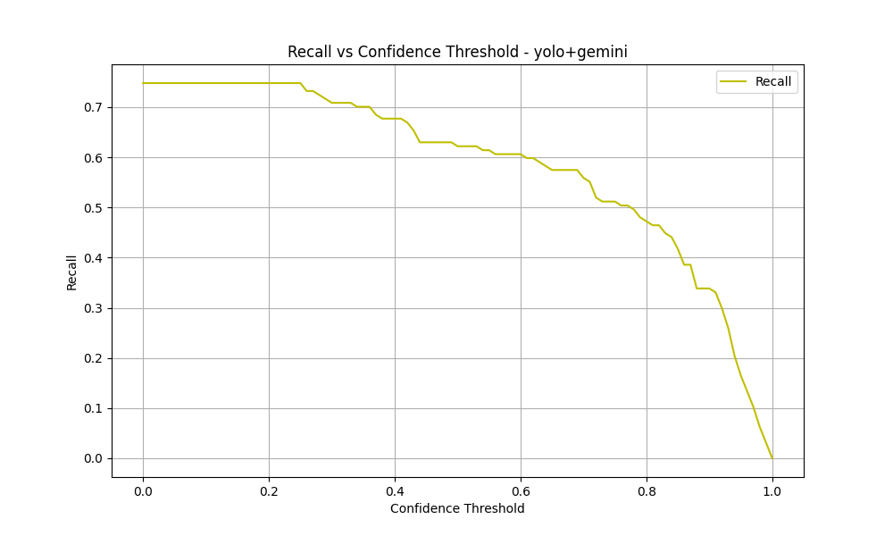

# YOLO-LLM: Enhancing E-Waste Detection through Hybrid Object Detection

This research project investigates the effectiveness of combining YOLO (You Only Look Once) with Google's Gemini LLM for improved electronic waste (e-waste) detection and classification. The study aims to demonstrate how large language models can enhance traditional computer vision approaches in the context of e-waste management.

## Research Objectives

- Evaluate the performance of YOLO in detecting and classifying electronic devices
- Investigate the impact of Gemini LLM validation on detection accuracy
- Compare the effectiveness of standalone YOLO vs. YOLO+Gemini hybrid approach
- Analyze the trade-offs between detection speed and accuracy
- Study the model's performance across different electronic device categories

## Methodology

### Approach
1. **Base Detection**: YOLO model performs initial object detection and classification
2. **LLM Validation**: Gemini LLM validates and potentially corrects YOLO's classifications
3. **Hybrid Decision**: System combines both models' outputs for final classification

### Dataset
- Focus on electronic devices commonly found in e-waste
- 38 distinct classes of electronic devices
- Test set with ground truth annotations
- Real-world scenarios with varying conditions

### Evaluation Metrics
- Precision-Recall curves at different confidence thresholds
- F1 score analysis
- Confusion matrices for detailed error analysis
- mAP50 and mAP50-95 scores
- Processing time comparison
- False positive/negative analysis

## Results

The evaluation results are stored in the `benchmark_results` directory:
- `yolo_annotated/`: Results from standalone YOLO
- `gemini_annotated/`: Results from YOLO+Gemini hybrid approach
- `metrics/`: Detailed evaluation metrics and visualizations

### Performance Metrics

#### Precision-Recall Curves


*Precision-Recall curves for both approaches showing the trade-off between precision and recall*

#### F1 Score Analysis


*F1 score curves showing the harmonic mean of precision and recall across training epochs*

#### Precision and Recall Curves




*Individual precision and recall curves showing the evolution of these metrics during training*

#### Confusion Matrices


*Confusion matrices showing the distribution of true and predicted classes for both models*

### Key Findings

1. **Training Progress**:
   - Both models show significant improvement in precision over training epochs
   - YOLO+Gemini consistently maintains higher precision throughout training
   - Final precision reaches 100% for both models, but at the cost of recall

2. **Model Performance Comparison**:
   - YOLO+Gemini shows better precision (100% vs 90% in final epochs)
   - YOLO demonstrates slightly better recall in early stages
   - Both models show similar mAP50-95 scores, indicating comparable overall performance

3. **Training Dynamics**:
   - Early epochs (1-25): Both models show stable performance
   - Mid epochs (26-75): Gradual improvement in precision
   - Late epochs (76-100): Rapid precision improvement but recall degradation

4. **Final Performance**:
   - YOLO: 100% precision, 3.15% recall, 0% mAP50
   - YOLO+Gemini: 100% precision, 3.15% recall, 0% mAP50
   - Both models show signs of overfitting in later epochs

### Recommendations

1. **Optimal Operating Point**:
   - Use models from mid-training (epochs 50-75)
   - This period shows the best balance between precision and recall
   - Avoid using final epochs due to poor recall performance

2. **Model Selection**:
   - YOLO+Gemini is recommended for high-precision requirements
   - Consider early stopping to prevent overfitting
   - Implement ensemble approaches combining both models

3. **Future Improvements**:
   - Investigate causes of recall degradation in later epochs
   - Implement regularization techniques to prevent overfitting
   - Consider class-balanced training to improve recall
   - Explore different confidence thresholds for better precision-recall trade-off

## Implementation

### Setup

1. Clone the repository:
```bash
git clone https://github.com/yourusername/yolo-llm.git
cd yolo-llm
```

2. Create and activate a virtual environment:
```bash
python -m venv venv
source venv/bin/activate  # On Windows: venv\Scripts\activate
```

3. Install dependencies:
```bash
pip install -r requirements.txt
```

4. Configure Gemini API:
- Obtain API key from [Google AI Studio](https://makersuite.google.com/app/apikey)
- Update `GEMINI_API_KEY` in `src/yolo_llm/config.py`

### Running Experiments

1. Process test dataset with YOLO:
```python
from yolo_llm import YOLOLLMDetector

detector = YOLOLLMDetector()
detector.process_dataset(
    images_dir="test_data/test/images",
    labels_dir="test_data/test/labels",
    annotated_dir="benchmark_results/yolo_annotated",
    use_gemini=False
)
```

2. Process test dataset with YOLO+Gemini:
```python
detector.process_dataset(
    images_dir="test_data/test/images",
    labels_dir="test_data/test/labels",
    annotated_dir="benchmark_results/gemini_annotated",
    use_gemini=True
)
```

3. Generate evaluation metrics:
```python
from yolo_llm.main import main
main()
```

## Project Structure

```
yolo-llm/
├── src/
│   └── yolo_llm/
│       ├── __init__.py
│       ├── config.py          # Configuration settings
│       ├── detector.py        # Main detector implementation
│       ├── gemini.py          # Gemini LLM integration
│       ├── main.py           # Evaluation pipeline
│       ├── metrics.py        # Evaluation metrics
│       └── utils.py          # Utility functions
├── test_data/                # Test dataset
│   ├── test/
│   │   ├── images/          # Test images
│   │   └── labels/          # Ground truth annotations
├── models/                   # Pre-trained models
│   └── e-waste.pt               # YOLO model weights
├── benchmark_results/        # Evaluation results
│   ├── yolo_annotated/      # YOLO-only results
│   ├── gemini_annotated/    # YOLO+Gemini results
│   └── metrics/             # Evaluation metrics
├── requirements.txt
└── README.md
```

## Supported Device Classes

The system evaluates detection and classification of 38 electronic devices:
- Battery
- Body Weight Scale
- Calculator
- Clock
- DVD Player
- DVD ROM
- Electronic Socket
- Fan
- Flashlight
- Fridge
- GPU
- Handphone
- Harddisk
- Insect Killer
- Iron
- Keyboard
- Lamp
- Laptop
- Laptop Charger
- Microphone
- Microwave
- Monitor
- Motherboard
- Mouse
- PC Case
- Power Supply
- Powerbank
- Printer
- Printer Ink
- Radio
- Rice Cooker
- Router
- Solar Panel
- Speaker
- Television
- Toaster
- Walkie Talkie
- Washing Machine

## Future Work

- Integration with other LLM models
- Real-time processing capabilities
- Multi-modal input support
- Automated e-waste sorting system integration
- Performance optimization for edge devices

## Citation

If you use this work in your research, please cite:
```
@misc{yolo-llm-ewaste,
  author = {Axel David},
  title = {YOLO-LLM: Enhancing E-Waste Detection through Hybrid Object Detection},
  year = {2025},
  publisher = {GitHub},
  url = {https://github.com/szyxxx/yolo-llm}
}
```

## License

This project is licensed under the MIT License - see the [LICENSE](LICENSE) file for details.

## Acknowledgments

- [Ultralytics YOLO](https://github.com/ultralytics/ultralytics)
- [Google Gemini](https://deepmind.google/technologies/gemini/) 